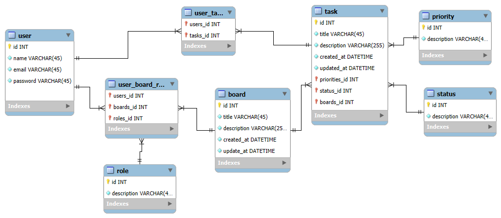

# Backend com NestJS e Docker


## Modelagem do Banco



## Requisitos

Antes de iniciar, certifique-se de ter instalado em sua máquina:

- [Docker](https://www.docker.com/get-started)
- [Docker Compose](https://docs.docker.com/compose/install/)
- [Yarn](https://yarnpkg.com/)

## Como rodar o projeto localmente

1. Clone este repositório:
   ```sh
   git clone https://github.com/JoaoMarcosCS/task-flow-back.git
   ```

2. Crie um arquivo `.env` na raiz do projeto com as configurações necessárias. Exemplo:
   ```env
    DATABASE_PORT=5432
    DATABASE_USERNAME="admin"
    DATABASE_PASSWORD="admin"
    DATABASE_NAME='task-flow'
    DATABASE_HOST='localhost'

    APP_PORT=3001

    JWT_EXPIRES='7d'
    JWT_SECRET="PJ23RH8DOM0--3JOENSPOKAO@@#%fdsS"

   ```

3. Inicie o container do banco de dados:
   ```sh
   docker-compose up -d
   ```

4. Instale as dependências do projeto:
   ```sh
   yarn install
   ```

6. Inicie a aplicação:
   ```sh
   yarn start:dev
   ```

7. O backend estará rodando em: 
   ```
   http://localhost:3001
   ```

## Tecnologias utilizadas

- NestJS
- TypeScript
- Docker
- PostgreSQL
- TypeORM
- Yarn

## Possíveis Erros e Soluções

1. **Porta em uso**
   - Verifique se a porta do backend (por padrão 3001) ou do banco de dados está em uso e altere no `.env` e `docker-compose.yml`.

2. **Banco de dados não inicia**
   - Certifique-se de que as credenciais do banco estão corretas e que o container está rodando.

3. **Erro ao instalar dependências**
   - Certifique-se de estar utilizando Yarn e rode `yarn install` novamente.


Se houver dúvidas, entre em contato +12996585137.


